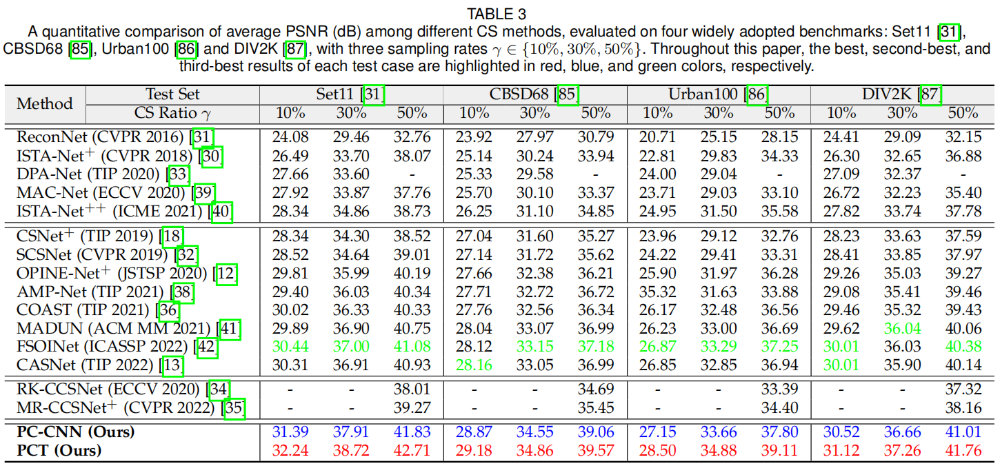

# (TPAMI 2024) Practical Compact Deep Compressed Sensing [PyTorch]

[](https://ieeexplore.ieee.org/document/10763443) [](https://arxiv.org/abs/2411.13081) 

[Bin Chen](https://scholar.google.com/citations?hl=en&user=aZDNm98AAAAJ) and [Jian Zhang](https://jianzhang.tech/)†

*School of Electronic and Computer Engineering, Peking University, Shenzhen, China.*

† Corresponding author

Accepted for publication in [IEEE Transactions on Pattern Analysis and Machine Intelligence](https://ieeexplore.ieee.org/xpl/RecentIssue.jsp?punumber=34) (TPAMI) 2024.

⭐ If PCNet is helpful to you, please star this repo. Thanks! 🤗

## 📝 Abstract

Recent years have witnessed the success of deep networks in compressed sensing (CS), which allows for a significant reduction in sampling cost and has gained growing attention since its inception. In this paper, we propose a new practical and compact network dubbed PCNet for general image CS. Specifically, in PCNet, a novel collaborative sampling operator is designed, which consists of a deep conditional filtering step and a dual-branch fast sampling step. The former learns an implicit representation of a linear transformation matrix into a few convolutions and first performs adaptive local filtering on the input image, while the latter then uses a discrete cosine transform and a scrambled block-diagonal Gaussian matrix to generate under-sampled measurements. Our PCNet is equipped with an enhanced proximal gradient descent algorithm-unrolled network for reconstruction. It offers flexibility, interpretability, and strong recovery performance for arbitrary sampling rates once trained. Additionally, we provide a deployment-oriented extraction scheme for single-pixel CS imaging systems, which allows for the convenient conversion of any linear sampling operator to its matrix form to be loaded onto hardware like digital micro-mirror devices. Extensive experiments on natural image CS, quantized CS, and self-supervised CS demonstrate the superior reconstruction accuracy and generalization ability of PCNet compared to existing state-of-the-art methods, particularly for high-resolution images. Code is available at https://github.com/Guaishou74851/PCNet.

## 🍭 Overview


## ⚙ Environment

```shell
torch==2.2.1
numpy==1.24.4
opencv-python==4.2.0
scikit-image==0.21.0
```

## ⚡ Test

Run the following command:

```shell
python test.py --testset_name=Set11
```

The test sets are in `./data`.

The recovered results will be in `./test_out`.

The test sets CBSD68, Urban100, and DIV2K are available at https://github.com/Guaishou74851/SCNet/tree/main/data.

For easy comparison, test results of various existing image CS methods are available on [Google Drive](https://drive.google.com/drive/folders/1Lif_7N_bCyILFLac5JcOtJ9cWpGBNVCd) and [PKU Disk](https://disk.pku.edu.cn/link/AA1C2D8A08050744449CBFCAB51A846B2D).

## 🔥 Train

Download the dataset of [Waterloo Exploration Database](https://kedema.org/project/exploration/index.html) and put the `pristine_images` directory (containing 4744 `.bmp` image files) into `./data`, then run the following command:

```
python train.py
```

The log and model files will be in `./log` and `./model`, respectively.

## 😍 Results




## 🎓 Citation

If you find the code helpful in your research or work, please cite the following paper:

```
@article{chen2024practical,
  title={Practical Compact Deep Compressed Sensing},
  author={Chen, Bin and Zhang, Jian},
  journal={IEEE Transactions on Pattern Analysis and Machine Intelligence},
  year={2024},
}
```
